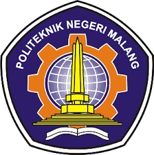
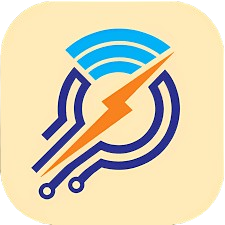
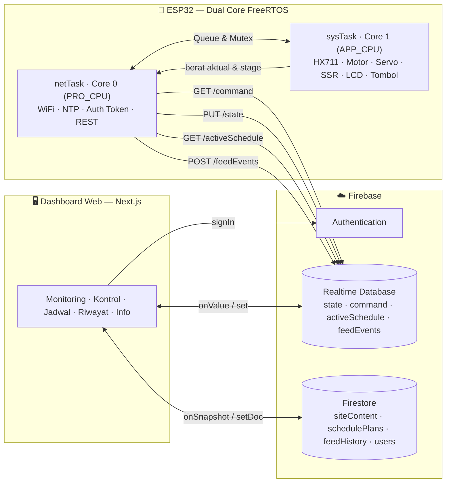

<div align="center">

&nbsp;&nbsp;&nbsp;

# 🦐 Smart Shrimp Feeder

### Alat Penakar Pakan Udang Otomatis Berbasis IoT

**Penakaran pakan menyesuaikan umur udang, divalidasi sensor berat (load cell), dikendalikan ESP32 dual-core, dipantau real-time lewat dashboard web.**

<br/>

[](https://shrimpfeeder-ebon.vercel.app)
[](https://github.com/Keyzoo0/ShrimpFeeder)

[](https://nextjs.org)
[](https://react.dev)
[](https://www.typescriptlang.org)
[](https://tailwindcss.com)
[](https://ui.shadcn.com)
[](https://firebase.google.com)
[](https://www.espressif.com)
[](https://shrimpfeeder-ebon.vercel.app)


<sub>Tugas Akhir — Program Studi Sarjana Terapan Teknik Elektronika · Jurusan Teknik Elektro · Politeknik Negeri Malang · 2026</sub>

</div>

---

## 📑 Daftar Isi

- [Tentang Proyek](#-tentang-proyek)
- [Latar Belakang, Tujuan & Manfaat](#-latar-belakang-tujuan--manfaat)
- [Fitur Utama](#-fitur-utama)
- [Arsitektur Sistem](#-arsitektur-sistem)
- [Cara Kerja Sistem (State Machine Feeding)](#-cara-kerja-sistem-state-machine-feeding)
- [Skema Penjadwalan Pakan (4 Siklus)](#-skema-penjadwalan-pakan-4-siklus)
- [Tech Stack](#-tech-stack)
- [Struktur Data (Firebase)](#-struktur-data-firebase)
- [Demo](#-demo)
- [Struktur Proyek](#-struktur-proyek)
- [Mulai Cepat](#-mulai-cepat)
- [Environment Variables](#-environment-variables)
- [Skrip NPM](#-skrip-npm)
- [Firmware ESP32 (Dual-Core)](#-firmware-esp32-dual-core)
- [Pin Mapping & Bill of Materials](#-pin-mapping--bill-of-materials)
- [Model Keamanan](#-model-keamanan)
- [Deployment](#-deployment)
- [Profil Penyusun (Info Mahasiswa)](#-profil-penyusun-info-mahasiswa)
- [Tentang Tugas Akhir](#-tentang-tugas-akhir)
- [Lisensi & Atribusi](#-lisensi--atribusi)

---

## 🎯 Tentang Proyek

**Smart Shrimp Feeder** adalah sistem penakar pakan udang otomatis yang menyesuaikan porsi pakan berdasarkan **umur udang**. Sistem menghitung kebutuhan pakan harian dari **biomassa** (jumlah udang × berat per ekor) dikalikan **Feeding Rate (FR)** sesuai fase pertumbuhan, lalu memvalidasi takaran yang keluar memakai **sensor berat (load cell + HX711)** secara real-time.

Otak alat adalah **ESP32 dual-core**: satu core khusus mengurus jaringan/IoT, satu core khusus mengontrol hardware real-time — sehingga koneksi internet yang lambat **tidak pernah** membekukan motor atau tombol darurat. Seluruh data dipertukarkan dengan **Firebase** (Authentication, Realtime Database, Firestore) sehingga alat dapat dipantau & dikendalikan dari mana saja lewat **dashboard web**.

> 💡 **Inti inovasi:** porsi pakan otomatis menyesuaikan umur/fase udang + verifikasi takaran oleh sensor berat → mengurangi pemborosan pakan akibat penakaran manual yang tidak konsisten.

---

## 🧭 Latar Belakang, Tujuan & Manfaat

### Latar Belakang
Pada budidaya udang, pakan menyumbang porsi biaya operasional terbesar. Penakaran manual cenderung tidak konsisten — berlebih menyebabkan pemborosan & memburuknya kualitas air, kurang menyebabkan pertumbuhan tidak optimal. Dibutuhkan sistem yang menakar pakan secara **terukur, terjadwal, dan terverifikasi**.

### Tujuan
- Merancang alat penakar pakan udang otomatis yang **porsinya menyesuaikan umur udang**.
- Memanfaatkan **sensor berat** sebagai validasi takaran agar dosis akurat.
- Mengintegrasikan alat dengan **IoT** untuk monitoring & kontrol jarak jauh secara real-time.

### Manfaat
- ⚖️ **Akurasi** — dosis pakan dihitung dari biomassa & FR, diverifikasi load cell.
- 💰 **Efisiensi** — meminimalkan pemborosan pakan & menjaga kualitas air.
- ⏱️ **Konsistensi** — penjadwalan otomatis beberapa kali sehari tanpa intervensi manual.
- 🌐 **Aksesibilitas** — pantau & kendalikan dari mana saja lewat web.

---

## ✨ Fitur Utama

| Kategori | Fitur |
|---|---|
| **Monitoring** | Berat load cell realtime, status motor/servo/blower, encoder, indikator online/offline alat, tahap (stage) proses feeding |
| **Respon Realtime** | Poll perintah **0,5 dtk** + koneksi Firebase **keep-alive** (tanpa handshake TLS berulang) → aksi tombol terasa di alat **≤ ~0,7 dtk** |
| **Kontrol Manual** | Buka/tutup motor katup, ON/OFF SSR blower, buka/tutup servo gate, **input takaran (gram)** + tombol **Mulai/Stop Feeding** |
| **Feed Manual Aman** | Takaran wajib diisi (tombol terkunci bila kosong/≤0), otomatis disarankan dari jadwal hari ini — mencegah dosis salah/fallback |
| **Penjadwalan Otomatis** | Tanggal mulai, offset umur, jumlah udang, berat awal/ekor, **jam makan dinamis** (bisa tambah/edit/hapus), 4 siklus pertumbuhan yang bisa diedit |
| **Perhitungan Pakan** | Setpoint per-feed dihitung otomatis dari biomassa × FR, tabel harian sepanjang masa tebar |
| **Riwayat** | Catatan tiap event pakan (waktu, berat ditakar vs setpoint, siklus, trigger) tersimpan di Firestore |
| **Multi-user** | Autentikasi email/password (Firebase Auth), beberapa pengguna memantau alat yang sama (last-write-wins) |
| **Info Tugas Akhir** | Data judul, mahasiswa & dosen pembimbing dapat diedit langsung dari dashboard, tersinkron realtime |
| **UX** | Tema Aqua Laut light/dark, responsif (mobile-first), komponen shadcn/ui aksesibel, notifikasi toast |

---

## 🏗️ Arsitektur Sistem



Komunikasi alat ↔ cloud memakai **REST API JSON murni** (tanpa SDK Firebase di firmware) agar ringan di mikrokontroler. Beban ESP32 dipisah ke dua core supaya request jaringan yang lambat tidak pernah membekukan kontrol motor / emergency stop / pembacaan tombol.

---

## ⚙️ Cara Kerja Sistem (State Machine Feeding)

Proses satu siklus pemberian pakan dijalankan sebagai **state machine** di `sysTask` (Core 1). Sebelum stage 1, timbangan **di-tare** dulu agar takaran akurat. Nilai `stage` ini dikirim ke `/state` dan ditampilkan di dashboard sebagai progress.

| Stage | Label | Aksi |
|:---:|---|---|
| — | **Tare** | Timbangan dinolkan (`scale.tare()`) sebelum siklus dimulai |
| 0 | **Idle** | Menunggu jadwal / perintah manual |
| 1 | **Buka Katup** | Motor BTS7960 membuka katup (target encoder `POSISI_BUKA`) |
| 2 | **Timbang** | Load cell HX711 menimbang pakan; katup ditutup di **`setpoint − WEIGH_OVERSHOOT_G` (−100 g)** untuk mengompensasi pakan yang masih jatuh saat menutup |
| 3 | **Tutup Katup** | Katup ditutup ke HOME (limit switch); takaran final disimpan |
| 4 | **Buka Servo** | Servo gate **dibuka** (sebelum blower) agar pakan turun ke jalur blower |
| 5 | **Jeda 3 dtk** | Tunggu `SETTLE_MS` (3 dtk) agar pakan turun stabil, baru blower |
| 6 | **Blower** | SSR menyalakan blower, mendorong pakan keluar sampai berat **< `EMPTY_THRESHOLD` (50 g)** |
| 7 | **Blower 3 dtk** | Blower lanjut `BLOW_EXTRA_MS` (3 dtk) untuk membersihkan sisa |
| 8 | **Tare + Tutup** | Blower OFF → **tare** → tutup servo → event dicatat `POST /feedEvents` |
| 9 | **Selesai** | Tunggu servo tertutup, kembali ke Idle |

**Pengaman (safety timeout):** gerak motor dibatasi `MOTOR_MOVE_TIMEOUT` (8 dtk), proses timbang `WEIGH_TIMEOUT` (60 dtk), pengosongan `EMPTY_TIMEOUT` (30 dtk). Penutupan katup memakai **limit switch** sebagai HOME (encoder dikalibrasi ulang ke 0). Perintah **Stop** dari dashboard memutus proses kapan pun lewat flag atomik `g_stopRequested`.

---

## 📊 Skema Penjadwalan Pakan (4 Siklus)

Pakan dihitung berdasarkan **fase pertumbuhan udang**. Setiap fase punya durasi (hari) dan **Feeding Rate (FR)** berbeda (default — dapat diedit di dashboard):

| Siklus | Durasi (hari) | FR (%) | Keterangan |
|---|:---:|:---:|---|
| 🟢 **Starter** | 14 | 15% | Pasca tebar, kebutuhan relatif tinggi |
| 🔵 **Early** | 14 | 10% | Pertumbuhan awal |
| 🟠 **Grower** | 28 | 8% | Fase pembesaran |
| 🔴 **Finisher** | 56 | 4% | Menjelang panen |
| | **Total 112 hari** | | Masa tebar default |

**Jam makan default:** `07:00 · 15:00 · 23:00` (3× sehari).

### Rumus perhitungan dosis

```
Biomassa total (g)      = berat_awal_per_ekor (g) × jumlah_udang (ekor)
Pakan harian (g)        = Biomassa × FR(%) ÷ 100
Setpoint per feed (g)   = Pakan harian ÷ jumlah_jam_makan
```

> **Contoh:** 1000 ekor × 5 g = 5.000 g biomassa. Fase Starter (FR 15%) → 750 g/hari ÷ 3 jam makan = **250 g per feed**.

Dashboard juga membangun **tabel harian** untuk seluruh masa tebar (umur → siklus → setpoint per hari) sehingga peternak bisa melihat proyeksi pakan dari awal hingga panen.

---

## 🧱 Tech Stack

| Layer | Teknologi |
|---|---|
| **Frontend** | Next.js `14.2.15` (App Router) · React `18.3.1` · TypeScript `5.5` · Tailwind CSS `3.4` |
| **UI** | shadcn/ui (Radix UI: dialog, label, separator, slot, switch, tabs) · lucide-react · next-themes · sonner (toast) · class-variance-authority · tailwind-merge |
| **Cloud / Backend** | Firebase `11.1` — Authentication · Realtime Database · Cloud Firestore |
| **Firmware** | ESP32 (Arduino C++) · FreeRTOS dual-core · ArduinoJson v6 · HX711 · ESP32Servo · LiquidCrystal_I2C · WiFiClientSecure + HTTPClient (REST) |
| **Hardware** | Load cell + HX711, motor DC + driver BTS7960 + encoder, servo gate, SSR + blower, LCD 16×2 I2C, 3 push button |
| **Deployment** | Vercel (web) · Firebase (cloud) |

---

## 🗄️ Struktur Data (Firebase)

### Realtime Database (RTDB) — komunikasi cepat alat ↔ web

```jsonc
/state                 // DeviceState — ditulis alat, dibaca web
  { weight, encoder, motor, ssr, servo, feeding,
    stage, stageLabel, online, lastSeen, error }

/command               // Command — ditulis web, dibaca alat
  { motor, ssr, servo, feedNow, setpoint, stop, ts, by }
  //                             ^ takaran manual (g) utk feedNow; null = pakai jadwal

/activeSchedule        // ActiveSchedule — jadwal aktif yang dipakai alat
  { enabled, startDate, offsetAge, count, initialWeight,
    feedTimes: ["07:00","15:00","23:00"],
    cycles: [{ name, days, fr }, ...] }

/feedEvents/{pushId}   // FeedEvent — log tiap pemberian pakan
  { ts, setpoint, delivered, cycle, trigger }
```

### Firestore — penyimpanan dokumen & arsip

| Koleksi / Dokumen | Isi |
|---|---|
| `siteContent/thesis` | Data Tugas Akhir (judul, mahasiswa, pembimbing) — diedit dari tab Info |
| `schedulePlans/{id}` | Arsip rencana jadwal yang disimpan, bisa dimuat ulang |
| `feedHistory/{id}` | Mirror riwayat feeding (idempotent by id) |
| `users/{uid}` | Profil pengguna |

---

## 🚀 Demo

Dashboard live di Vercel — login memakai akun yang telah didaftarkan admin (tidak ada pendaftaran mandiri).

<div align="center">

### 🔗 **[shrimpfeeder-ebon.vercel.app](https://shrimpfeeder-ebon.vercel.app)**

</div>

<details>
<summary><b>Pratinjau alur penggunaan</b></summary>

1. **Login** — autentikasi email/password (Firebase Auth).
2. Tab **Dashboard** — monitoring berat & status, kontrol manual, penjadwalan, riwayat pakan.
3. Tab **Info** — data Tugas Akhir, dapat diedit lewat dialog Edit & tersinkron Firestore di semua perangkat.

</details>

---

## 📁 Struktur Proyek

```
ramadhan_udang/
├── README.md                            # Dokumen ini
├── docs/                                # Aset logo institusi
├── firmware/
│   └── shrimp_feeder_firebase/
│       └── shrimp_feeder_firebase.ino   # Firmware ESP32 dual-core (REST ke Firebase)
└── udang_website/                       # Dashboard web (Next.js)
    ├── app/
    │   ├── page.tsx                     # Dashboard (monitoring, kontrol, jadwal, riwayat)
    │   ├── info/page.tsx                # Tab Info Tugas Akhir (+ dialog edit)
    │   ├── login/page.tsx               # Halaman login
    │   ├── layout.tsx · providers.tsx   # Root layout, theme & font
    │   └── globals.css                  # Tema Aqua Laut (token CSS light/dark)
    ├── components/
    │   ├── AppShell.tsx                 # Header, tab nav, auth-guard, badge online
    │   ├── Monitoring.tsx               # Berat realtime, flow stage, status komponen
    │   ├── ControlPanel.tsx             # Kontrol manual + input takaran + mulai/stop feeding
    │   ├── ScheduleManager.tsx          # Penjadwalan 4 siklus + jam makan dinamis + tabel harian
    │   ├── History.tsx                  # Riwayat feeding
    │   └── ui/                          # Komponen shadcn/ui (button, card, dialog, ...)
    ├── hooks/
    │   ├── useAuth.tsx                  # State autentikasi (AuthProvider context)
    │   └── useRtdb.ts                   # Baca/tulis Realtime Database + sendCommand
    ├── lib/
    │   ├── firebase.ts                  # Inisialisasi Firebase
    │   ├── schedule.ts                  # Logika siklus & perhitungan setpoint
    │   ├── thesis.ts                    # Model & sinkronisasi data Tugas Akhir
    │   ├── types.ts                     # Tipe DeviceState, Command, FeedEvent
    │   └── utils.ts                     # Helper (cn)
    └── firebase/
        ├── firestore.rules              # Security rules Firestore
        └── database.rules.json          # Security rules Realtime Database
```

---

## ⚡ Mulai Cepat

```bash
# 1. Clone repositori
git clone https://github.com/Keyzoo0/ShrimpFeeder.git
cd ShrimpFeeder/udang_website

# 2. Install dependencies
npm install

# 3. Siapkan environment (isi kredensial Firebase project Anda)
cp .env.example .env.local

# 4. Jalankan dev server
npm run dev
```

Buka **http://localhost:3000**. Build produksi: `npm run build && npm run start`.

---

## 🔐 Environment Variables

Salin `.env.example` → `.env.local`, lalu isi dari **Firebase Console → Project Settings → Web App**:

| Variabel | Keterangan |
|---|---|
| `NEXT_PUBLIC_FIREBASE_API_KEY` | API key Firebase Web App |
| `NEXT_PUBLIC_FIREBASE_AUTH_DOMAIN` | Domain Firebase Auth |
| `NEXT_PUBLIC_FIREBASE_DATABASE_URL` | URL Realtime Database |
| `NEXT_PUBLIC_FIREBASE_PROJECT_ID` | ID Project Firebase |
| `NEXT_PUBLIC_FIREBASE_STORAGE_BUCKET` | Storage bucket |
| `NEXT_PUBLIC_FIREBASE_MESSAGING_SENDER_ID` | Sender ID (FCM) |
| `NEXT_PUBLIC_FIREBASE_APP_ID` | App ID |
| `NEXT_PUBLIC_FIREBASE_MEASUREMENT_ID` | Google Analytics measurement ID |

> ℹ️ Variabel `NEXT_PUBLIC_*` Firebase Web Config **bukan rahasia** — keamanan data dijamin oleh Firebase Authentication & Security Rules, bukan oleh kerahasiaan key ini.

---

## 📜 Skrip NPM

| Skrip | Fungsi |
|---|---|
| `npm run dev` | Jalankan dev server (hot reload) |
| `npm run build` | Build produksi yang teroptimasi |
| `npm run start` | Jalankan hasil build produksi |
| `npm run lint` | Linting dengan ESLint (next/core-web-vitals) |

---

## 🔧 Firmware ESP32 (Dual-Core)

Firmware ada di [`firmware/shrimp_feeder_firebase/`](firmware/shrimp_feeder_firebase). Ditulis Arduino C++, memisahkan beban ke **dua core FreeRTOS**:

- **Core 0 — `netTask` (PRO_CPU):** WiFi + reconnect, NTP (WIB UTC+7), autentikasi & refresh token Firebase, lalu `GET /command`, `PUT /state`, `GET /activeSchedule`, `POST /feedEvents`. Semua lewat **REST API** (`WiFiClientSecure` + `HTTPClient` + `ArduinoJson`) memakai **koneksi keep-alive** (socket TLS dipakai ulang → hemat handshake ~1 dtk/request → respon cepat), tanpa SDK Firebase.
- **Core 1 — `sysTask` (APP_CPU):** HX711 (load cell), motor DC (BTS7960 + encoder + **limit switch HOME** + safety timeout), servo non-blocking, blower (SSR), LCD 16×2 I2C, 3 push button, dan **state-machine feeding** + scheduler. Saat boot melakukan **homing** (motor menutup penuh sampai limit switch → kalibrasi encoder = 0, posisi awal pasti aman). Real-time, tidak pernah diblok jaringan.

> **Aturan emas:** objek jaringan hanya disentuh Core 0; hardware (HX711/Servo/LCD/motor/SSR) hanya disentuh Core 1. Data lintas-core hanya lewat `cmdQueue`, `feedEvtQueue`, `stateMutex`, `schedMutex`, dan flag atomik (`g_fbReady`, `g_wifiOnline`, `g_stopRequested`).

<details>
<summary><b>Parameter & interval firmware</b></summary>

| Parameter | Nilai default |
|---|---|
| Poll command | **500 ms** (koneksi keep-alive) |
| Push state | **1000 ms** |
| Fetch schedule | 30000 ms |
| Refresh LCD | 500 ms |
| Timeout gerak motor | 8000 ms |
| Timeout timbang | 60000 ms |
| Timeout pengosongan | 30000 ms |
| Berat valid minimum | 50 g (di bawahnya dianggap 0) |
| Threshold kosong (`EMPTY_THRESHOLD`) | **50 g** |
| Kompensasi overshoot (`WEIGH_OVERSHOOT_G`) | **100 g** — katup ditutup di `setpoint − 100` |
| Jeda servo → blower (`SETTLE_MS`) | 3000 ms |
| Blower lanjut setelah <50 g (`BLOW_EXTRA_MS`) | 3000 ms |
| NTP server | `pool.ntp.org`, `time.google.com` |
| Core requirement | Arduino-ESP32 core 3.x |

**Library:** `ArduinoJson` v7 · `HX711` · `LiquidCrystal_I2C` · `ESP32Servo`.

</details>

---

## 🔌 Pin Mapping & Bill of Materials

### Pin Mapping (ESP32)

| Pin | Fungsi | Komponen |
|:---:|---|---|
| 15 | DATA | HX711 (load cell) |
| 5 | CLK | HX711 (load cell) |
| 26 | RPWM | BTS7960 (motor maju) |
| 25 | LPWM | BTS7960 (motor mundur) |
| 34 | ENCODER_A | Encoder posisi katup |
| 35 | ENCODER_B | Encoder posisi katup |
| 19 | LIMIT_SW | Limit switch HOME katup (aktif LOW, `INPUT_PULLUP`) |
| 14 | SSR_PIN | Blower (SSR) |
| 23 | SERVO_PIN | Servo gate pakan |
| 32 | PB1 | Push button — Motor |
| 33 | PB2 | Push button — SSR |
| 27 | PB3 | Push button — Servo |
| 21 / 22 | SDA / SCL | LCD 16×2 I2C (alamat `0x27`) |

> Konstanta tunable: `POSISI_BUKA 461`, `POSISI_TUTUP 0` (HOME = limit switch), `PWM_MOTOR 120`, `TOLERANSI 3`, `SERVO_CLOSE 0°`, `SERVO_OPEN 40°`, `WEIGH_OVERSHOOT_G 100 g`.
>
> **Penutupan katup:** limit switch adalah otoritas HOME (saat tertekan → motor stop + encoder di-nol-kan). Encoder jadi cadangan bila switch gagal. Saat boot alat melakukan homing otomatis.

### Bill of Materials (komponen utama)

- ESP32 DevKit (mikrokontroler dual-core)
- Load cell + modul amplifier **HX711**
- Motor DC + driver **BTS7960** + rotary **encoder**
- **Limit switch** (kalibrasi HOME / posisi tutup katup)
- **Servo** (gate penjatuh pakan)
- **SSR** (Solid State Relay) + **blower**
- **LCD 16×2 I2C**
- 3× **push button** (kontrol manual lokal)
- Catu daya sesuai kebutuhan motor & blower

---

## 🛡️ Model Keamanan

- **Autentikasi:** semua akses (web & alat) memerlukan login Firebase Auth. Tidak ada pendaftaran mandiri — akun dibuat admin.
- **Realtime Database rules:** `read/write` hanya untuk `auth != null`, dengan validasi tipe pada field tertentu (mis. `ts` harus number).
- **Firestore rules:** akses `schedulePlans`, `feedHistory`, `siteContent` butuh login; dokumen `users/{uid}` hanya bisa ditulis pemiliknya; selain itu ditolak (`deny by default`).
- **Alat (ESP32)** memakai akun **device** khusus di Firebase Auth untuk memperoleh token, lalu mengakses REST API dengan token tersebut.

---

## 🌐 Deployment

| Komponen | Platform | Catatan |
|---|---|---|
| Dashboard web | **Vercel** | Auto-build Next.js; env var Firebase di-set di Project Settings |
| Cloud (Auth/RTDB/Firestore) | **Firebase** | Rules di-deploy via `firebase/firestore.rules` & `firebase/database.rules.json` |
| Firmware | **ESP32** | Flash via Arduino IDE / arduino-cli (Arduino-ESP32 core 3.x) |

**Live:** [https://shrimpfeeder-ebon.vercel.app](https://shrimpfeeder-ebon.vercel.app)

---

## 🎓 Profil Penyusun (Info Mahasiswa)

<div align="center">

| | |
|---|---|
| 👤 **Nama** | **Ramadan Putra Ariani** |
| 🆔 **NIM** | 2241170025 |
| 📚 **Program Studi** | Sarjana Terapan (D4) Teknik Elektronika |
| 🏛️ **Jurusan** | Teknik Elektro |
| 🏫 **Kampus** | Politeknik Negeri Malang (POLINEMA) |
| 📅 **Tahun** | 2026 |

</div>

> Data dosen pembimbing dikelola langsung dari aplikasi pada tab **Info → Edit Data Tugas Akhir** dan tersinkron realtime lewat Firestore (`siteContent/thesis`).

---

## 📋 Tentang Tugas Akhir

| | |
|---|---|
| **Judul** | PERANCANGAN ALAT PENAKAR PAKAN UDANG BERDASARKAN UMUR UDANG MENGGUNAKAN SENSOR BERAT BERBASIS IOT |
| **Penyusun** | Ramadan Putra Ariani — NIM 2241170025 |
| **Program Studi** | Sarjana Terapan Teknik Elektronika |
| **Jurusan** | Teknik Elektro |
| **Kampus** | Politeknik Negeri Malang |
| **Tahun** | 2026 |
| **Dosen Pembimbing** | Dikelola pada tab **Info** di dashboard (tersinkron Firestore) |
| **Jenis** | Tugas Akhir / Skripsi (Sarjana Terapan) |

---

## 📄 Lisensi & Atribusi

Proyek ini dibuat untuk keperluan **Tugas Akhir (Skripsi)** di Politeknik Negeri Malang. Silakan gunakan sebagai **referensi akademik** dengan mencantumkan atribusi kepada penyusun. Bukan untuk penggunaan komersial tanpa izin.

---

<div align="center">

**🦐 Smart Shrimp Feeder** — dibangun dengan Next.js, Firebase & ESP32.

<sub>Politeknik Negeri Malang · Jurusan Teknik Elektro · 2026</sub>

<br/>

[](https://shrimpfeeder-ebon.vercel.app)

</div>
