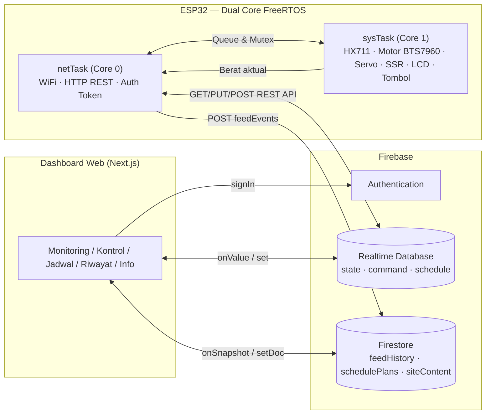

<div align="center">

&nbsp;&nbsp;&nbsp;

# Smart Shrimp Feeder

**Alat Penakar Pakan Udang Otomatis Berbasis IoT**
Dashboard web realtime + firmware ESP32 dual-core, terhubung lewat Firebase.

[](https://nextjs.org)
[](https://react.dev)
[](https://www.typescriptlang.org)
[](https://tailwindcss.com)
[](https://ui.shadcn.com)
[](https://firebase.google.com)
[](https://www.espressif.com)
[](https://shrimpfeeder-ebon.vercel.app)

<sub>Tugas Akhir — Program Studi Sarjana Terapan Teknik Elektronika, Jurusan Teknik Elektro, Politeknik Negeri Malang</sub>

</div>

---

## Daftar Isi

- [Tentang](#tentang)
- [Fitur](#fitur)
- [Arsitektur Sistem](#arsitektur-sistem)
- [Tech Stack](#tech-stack)
- [Demo](#demo)
- [Struktur Proyek](#struktur-proyek)
- [Mulai Cepat](#mulai-cepat)
- [Firmware ESP32](#firmware-esp32)
- [Tentang Tugas Akhir](#tentang-tugas-akhir)
- [Lisensi](#lisensi)

---

## Tentang

**Smart Shrimp Feeder** adalah sistem penakar pakan udang otomatis yang menyesuaikan porsi pakan berdasarkan **umur udang**, menggunakan **sensor berat (load cell + HX711)** untuk validasi takaran secara real-time. Alat dikendalikan oleh **ESP32 dual-core** dan terhubung ke **Firebase** sehingga dapat dipantau & dikendalikan dari mana saja lewat **dashboard web** — termasuk kontrol manual, penjadwalan otomatis 4 siklus per hari, riwayat pemberian pakan, dan status alat secara realtime.

Proyek ini dibangun untuk mendukung efisiensi pakan pada budidaya udang, mengurangi pemborosan pakan akibat penakaran manual yang tidak konsisten.

## Fitur

- **Kontrol manual realtime** — motor, servo gate, dan blower dapat dikendalikan langsung dari dashboard dengan status live (online/offline alat).
- **Penjadwalan otomatis** — 4 siklus pemberian pakan per hari, porsi pakan menyesuaikan umur udang.
- **Riwayat pemberian pakan** — setiap event pakan tercatat (waktu, berat aktual, status) dan tersimpan di Firestore.
- **Multi-user** — autentikasi email/password (Firebase Auth), beberapa pengguna dapat memantau alat yang sama.
- **Tab Info Tugas Akhir** — data judul, mahasiswa, dan dosen pembimbing, dapat diedit langsung dari dashboard dan tersinkron real-time lewat Firestore.
- **Tema Aqua Laut** — light & dark mode (toggle), didesain responsif untuk desktop maupun mobile.
- **UI berbasis shadcn/ui** — komponen konsisten, accessible (Radix UI), dan dianimasikan halus.

## Arsitektur Sistem



Komunikasi alat ↔ cloud memakai **REST API JSON murni** (tanpa SDK Firebase di firmware) agar ringan di mikrokontroler. Beban kerja ESP32 dipisah ke dua core agar request jaringan yang lambat tidak pernah membekukan kontrol motor / emergency stop.

## Tech Stack

| Layer | Teknologi |
|---|---|
| **Frontend** | Next.js 14 (App Router), React 18, TypeScript, Tailwind CSS, shadcn/ui (Radix UI), lucide-react, next-themes, sonner |
| **Backend / Cloud** | Firebase Authentication, Realtime Database, Firestore |
| **Firmware** | ESP32 (Arduino C++), FreeRTOS dual-core, ArduinoJson, HX711, ESP32Servo, LiquidCrystal_I2C |
| **Hardware** | Load cell + HX711, motor DC + driver BTS7960 + encoder, servo gate, SSR + blower, LCD 16×2 I2C, push button |
| **Deployment** | Vercel |

## Demo

Dashboard di-deploy di Vercel — silakan login menggunakan akun yang telah didaftarkan oleh admin (tidak ada pendaftaran mandiri).

<div align="center">

[](https://shrimpfeeder-ebon.vercel.app)

</div>

<details>
<summary><b>Pratinjau alur</b></summary>

1. Halaman **Login** — autentikasi email/password.
2. Tab **Dashboard** — monitoring berat & status alat, kontrol manual, penjadwalan, riwayat pakan.
3. Tab **Info** — data Tugas Akhir, dapat diedit lewat dialog Edit dan tersinkron Firestore di semua perangkat.

</details>

## Struktur Proyek

```
ramadhan_udang/
├── docs/                            # Aset logo (Politeknik & Teknik Elektro)
├── firmware/
│   └── shrimp_feeder_firebase/      # Firmware ESP32 dual-core (REST API ke Firebase)
└── udang_website/                   # Dashboard web
    ├── app/
    │   ├── page.tsx                 # Dashboard (monitoring, kontrol, jadwal, riwayat)
    │   ├── info/page.tsx            # Tab Info Tugas Akhir
    │   └── login/page.tsx           # Login
    ├── components/
    │   ├── AppShell.tsx             # Header, tab nav, auth-guard
    │   ├── Monitoring.tsx, ControlPanel.tsx, ScheduleManager.tsx, History.tsx
    │   └── ui/                      # Komponen shadcn/ui (button, card, dialog, tabs, ...)
    ├── hooks/                       # useAuth, useRtdb
    ├── lib/                        # firebase.ts, thesis.ts, schedule.ts, types.ts
    ├── firebase/                   # firestore.rules, database.rules.json
    └── public/                     # logo-polinema.png, logo-elektro.png
```

## Mulai Cepat

```bash
# 1. Clone
git clone https://github.com/keyzoo0/ShrimpFeeder.git
cd ShrimpFeeder/udang_website

# 2. Install dependencies
npm install

# 3. Salin contoh env, isi dengan kredensial Firebase project Anda
cp .env.example .env.local

# 4. Jalankan dev server
npm run dev
```

Buka `http://localhost:3000`.

<details>
<summary><b>Environment Variables</b></summary>

| Variabel | Keterangan |
|---|---|
| `NEXT_PUBLIC_FIREBASE_API_KEY` | API key Firebase Web App |
| `NEXT_PUBLIC_FIREBASE_AUTH_DOMAIN` | Domain Firebase Auth |
| `NEXT_PUBLIC_FIREBASE_DATABASE_URL` | URL Realtime Database |
| `NEXT_PUBLIC_FIREBASE_PROJECT_ID` | ID Project Firebase |
| `NEXT_PUBLIC_FIREBASE_STORAGE_BUCKET` | Storage bucket |
| `NEXT_PUBLIC_FIREBASE_MESSAGING_SENDER_ID` | Sender ID (FCM) |
| `NEXT_PUBLIC_FIREBASE_APP_ID` | App ID |
| `NEXT_PUBLIC_FIREBASE_MEASUREMENT_ID` | Google Analytics measurement ID |

Variabel `NEXT_PUBLIC_*` Firebase Web Config bukan rahasia — keamanan data dijamin oleh Firebase Authentication & Security Rules (`firebase/firestore.rules`, `firebase/database.rules.json`), bukan oleh kerahasiaan key ini.

</details>

## Firmware ESP32

Firmware ada di [`firmware/shrimp_feeder_firebase/`](firmware/shrimp_feeder_firebase) — ditulis dengan Arduino C++, memisahkan beban ke **dua core**:

- **Core 0 (`netTask`)** — WiFi, NTP, autentikasi & refresh token Firebase, polling command/jadwal, push state, kirim feed event. Seluruhnya lewat **REST API** (`HTTPClient` + `ArduinoJson`), tanpa SDK Firebase.
- **Core 1 (`sysTask`)** — pembacaan HX711 (load cell), kontrol motor DC (BTS7960 + encoder), servo gate, blower (SSR), LCD I2C, push button, dan state-machine proses pemberian pakan. Real-time, tidak pernah diblok oleh jaringan.

<details>
<summary><b>Pin Mapping</b></summary>

| Pin | Fungsi | Komponen |
|---|---|---|
| 15 | DATA | HX711 (load cell) |
| 5 | CLK | HX711 (load cell) |
| 26 | RPWM | BTS7960 (motor DC maju) |
| 25 | LPWM | BTS7960 (motor DC mundur) |
| 34 | ENCODER_A | Encoder posisi katup |
| 35 | ENCODER_B | Encoder posisi katup |
| 14 | SSR_PIN | Blower (SSR) |
| 23 | SERVO_PIN | Servo gate |
| 32 / 33 / 27 | PB1 / PB2 / PB3 | Push button (motor / SSR / servo) |
| 21 / 22 | SDA / SCL | LCD 16×2 I2C |

**Library yang dibutuhkan:** `ArduinoJson` v6, `HX711`, `LiquidCrystal_I2C`, `ESP32Servo` — Arduino-ESP32 core 3.x.

</details>

## Tentang Tugas Akhir

| | |
|---|---|
| **Judul** | PERANCANGAN ALAT PENAKAR PAKAN UDANG BERDASARKAN UMUR UDANG MENGGUNAKAN SENSOR BERAT BERBASIS IOT |
| **Penyusun** | Ramadan Putra Ariani — NIM 2241170025 |
| **Program Studi** | Sarjana Terapan Teknik Elektronika |
| **Jurusan** | Teknik Elektro |
| **Kampus** | Politeknik Negeri Malang |
| **Tahun** | 2026 |
| **Dosen Pembimbing** | Lihat & kelola pada tab **Info** di dashboard (tersinkron Firestore) |

## Lisensi

Proyek ini dibuat untuk keperluan **Tugas Akhir (Skripsi)** di Politeknik Negeri Malang. Silakan gunakan sebagai referensi akademik dengan mencantumkan atribusi.

---

<div align="center">
<sub>Dibuat dengan Next.js, Firebase, dan ESP32 — Politeknik Negeri Malang, 2026.</sub>
</div>
